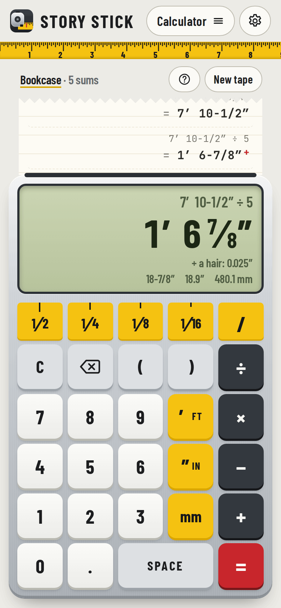
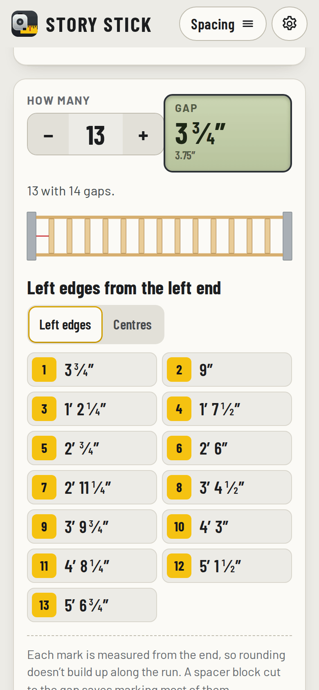
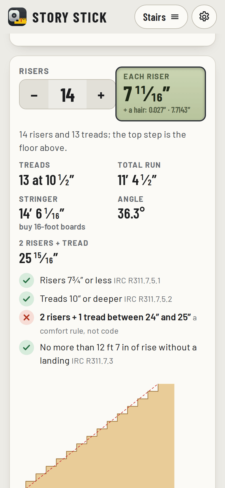

# Story Stick

**Use it: [junkdrawer.works/story-stick](https://junkdrawer.works/story-stick/)**

**A calculator that works in feet, inches and sixteenths.** Type `3' 7-5/16" + 11 3/8"` the way you'd write it and get `4′ 6-11/16″`, worked out exactly and read like a tape, with what the rounding left out. Around it are the shop sums that come up at the saw: evenly spaced balusters, a board split into equal parts, stairs, miters and crown, board feet, right triangles and square, and fractions to millimetres. It's the workshop partner to [Kerf](https://junkdrawer.works/kerf/).

<p align="center">
  
  &nbsp;
  
  &nbsp;
  
</p>

## How it works

- **Type lengths the way you write them.** `3' 7-5/16"`, `3'7 5/16`, `3 ft 7 in`, `43.3125`, `1100mm`, `7½"` all work, in any mix. On the keypad a number and then ¹⁄₁₆ counts sixteenths (`5` ¹⁄₁₆ is 5/16), and space separates whole inches from the fraction. A plain number added to a length counts as inches.
- **Exact, then rounded for reading.** Every sum is done in whole-number fractions, however many steps it takes, so `1100mm ÷ 3` or a board split seven ways doesn't drift. The answer is rounded to the nearest 1/16 (or 1/8, 1/32, 1/64) only to show it, with **+ a hair** or **− a hair** saying what was left out, and the same length in inches, decimal inches and millimetres.
- **Times and divide.** A length times or divided by a number is a length. A length divided by a length is a count, with what's left over (`8' ÷ 11-3/4"` is 8 whole and 2″). Two lengths multiplied make an area, three make a volume, shown in board feet too. × and ÷ go before + and −, and brackets work.
- **A paper tape.** Each sum prints on a tape like an adding machine's. Tap a line to use its answer again, exactly; a sign pressed first carries on from the last answer. Name a tape, start a new one, reopen the last 20, or copy one as text.
- **Even spacing.** The space, the width of each baluster, picket or board and the largest gap give the fewest that fit, the exact gap, and each mark from the end as a tape reading. A gap or an item at each end, left edges or centres, and one more or fewer to see the gap change.
- **Divide a board.** Equal parts with the saw kerf allowed for (1/8″ unless you say), or how many pieces of one length a board gives and the offcut.
- **Stairs.** From the total rise: the risers, their height, the treads, the total run, the stringer length and the board to buy it from, the angle, framing-square settings, and the height of every step from the floor. It checks the US house code (IRC R311.7: risers 7¾″ at most, treads 10″ at least, 12′ 7″ of rise between landings) and the 2 risers + 1 tread comfort rule, and says plainly to check your local code.
- **Miters.** The saw setting and corner angle for a frame with any number of sides, and long-point lengths from the inside length and stock width. For a corner of any angle, the miter for flat trim, and for crown the miter and bevel laid flat or the miter nested upside down, for 38° (52/38), 45° or any spring angle.
- **Board feet.** Thickness in quarters (4/4, 8/4) or any size, width, length and count, with cost from a price per board foot, and a running list for the lumber yard that adds up and copies as text.
- **Triangles and square.** Any two of rise, run and diagonal give the third, the angle, the roof pitch in 12 and the rafter length per foot of run. For squaring up a frame: the diagonal it should have, what two measured diagonals say and which corners to push, and the biggest 3-4-5 that fits.
- **Convert.** A size typed any way, shown every other way, with the nearest fraction at each size from halves to 64ths and how far off each is, and a chart of fractions, decimals and millimetres.
- **Every box is a calculator.** Length boxes in the tools take sums too (`8' - 2 × 3/4"`), and say how they read them. On a phone the shop keypad slides up for them instead of the phone's keyboard.
- No account and no server. Tapes, the lumber list and what you last typed in each tool stay in your browser. It works offline and installs to a phone's home screen. Light and dark follow your phone.

## Running it

It's a static site: plain HTML, CSS and JavaScript modules, with no build step.

```sh
npx serve .                   # or any static file server, then open the printed address
npm install                   # only for the tools below: esbuild and upng-js
npm test                      # the arithmetic and every tool's maths (Node 20+), then the real page in Chromium (needs Playwright)
node tools/screenshots.mjs    # redraws docs/*.png and og.png
node tools/make-icons.mjs     # redraws the PNG icons from icon.svg
npm run build                 # dist/story-stick.html, the whole app in one file, and dist/artifact.html
```

To put it online with GitHub Pages: **Settings → Pages → Build and deployment → Deploy from a branch**, then pick `main` and `/ (root)`.

### Files

- `js/rational.js`: exact fractions with BigInt. `js/measure.js`: reads a sum (`3' 7-5/16" + 11 3/8"`) and works it out, keeping track of lengths, areas and volumes. `js/format.js`: rounding and tape readings. No page code in any of them, so the tests run them in Node.
- `js/tools.js`: the maths behind each tool: spacing, dividing, stairs, miters and crown, board feet, triangles, square, fractions.
- `js/calc.js`: the calculator and its paper tape. `js/keypad.js` and `js/keys.js`: the keypad, what each key types, and the keypad that slides up on a phone.
- `js/screens/`: one file per tool. `js/draw.js`: the drawings (balusters, the board, the stairs, the frame, the triangle).
- `js/app.js`: which screen goes with which address, the menus and settings. `js/ui.js`: pieces every screen uses. `js/store.js`: saving in the browser.
- `fonts/`: Barlow, Barlow Condensed and JetBrains Mono, all under the SIL Open Font License, served from here so nothing loads from elsewhere.
- `sw.js`: keeps a copy for using offline. `scripts/build.mjs`: the one-file copy.
- `test/unit.test.mjs` checks the fractions, reading sums every way above (and the ways that don't make sense), rounding, every answer typing back in exactly, random tape sums, the keypad, and each tool, including crown angles against the saw detents and a vector derivation. `test/e2e.mjs` types on the keypad on a phone, reuses tape answers, changes the rounding, works each tool with the slide-up keypad, types on a laptop keyboard, and checks it fits a phone and works offline.
